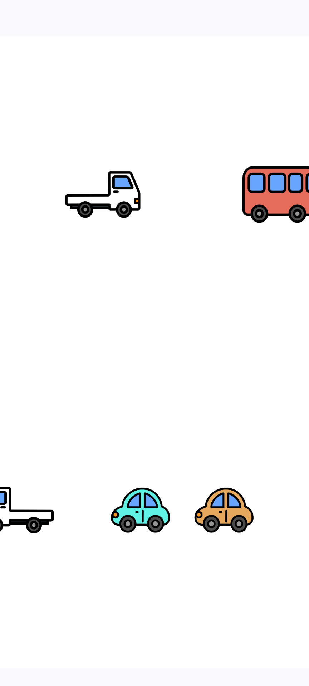

# オモチャバコ

## 機能一覧

| 機能 | 説明 | 画像・動画                                                                             |
| --- | --- |-----------------------------------------------------------------------------------|
| 車両 | 複数の車両が自動的に走る。ユーザーは車両を止めることができ、車両を止めると、渋滞が発生する。 |                          |
| 打楽器 | 8 種類の打楽器のボタンがあり、ボタンをタップすると対応する楽器の音がなる。 |  |
| 魚群 | 魚群のシミュレーション。タップすると周囲の魚が逃げる | https://youtube.com/shorts/edAh27vCm04                                            |
| サインポール | サインポールのシミュレーション。 - 再生開始・停止 - 回転の向き変更 - 再生速度変更 - 色変更 | https://youtube.com/shorts/N72epCuQm-E                                            |
| 万華鏡 | 万華鏡のシミュレーション。画像選択・回転操作が可能 | https://youtube.com/shorts/g26pVOUF4vs                                            |

### 基本機能

| 機能 | 説明 |
| --- | --- |
| お知らせ | Firebase Remote Config で動的に表示。既読管理付き |
| 強制アップデート | 古いバージョンの使用をブロックし、アップデートを促す |
| 利用規約同意 | 初回起動時に同意を求め、規約更新時には再同意を促す |

## 技術スタック

| カテゴリ | 技術 | 備考 |
| --- | --- | --- |
| 言語 | Kotlin, C++ | C++ は Vulkan 描画モジュールで使用 |
| UI | Jetpack Compose, Material 3 | 宣言的 UI によるモダンな画面構成 |
| グラフィックス | OpenGL ES 3.0, Vulkan | 車両・魚群・サインポールは OpenGL ES、万華鏡は Vulkan |
| 通信 | Firebase Remote Config | お知らせ・強制アップデート機能で使用 |
| DI | Hilt | - |
| ストレージ | Room, DataStore | Room でお知らせ永続化、DataStore で既読フラグ・同意状態を管理 |
| テスト | JUnit , Mockk, Robolectric, Espresso | - |
| 画像読み込み | Coil | - |
| アーキテクチャ | MVVM + Clean Architecture | Repository パターンによるデータ層の抽象化 |

